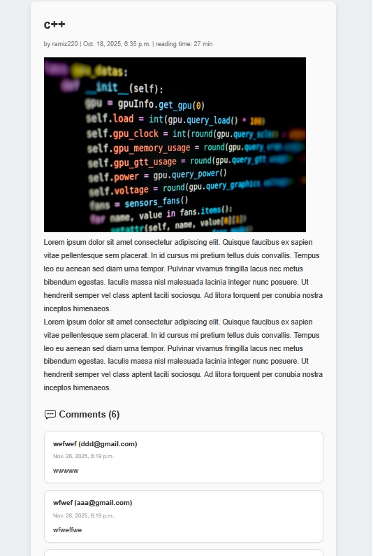
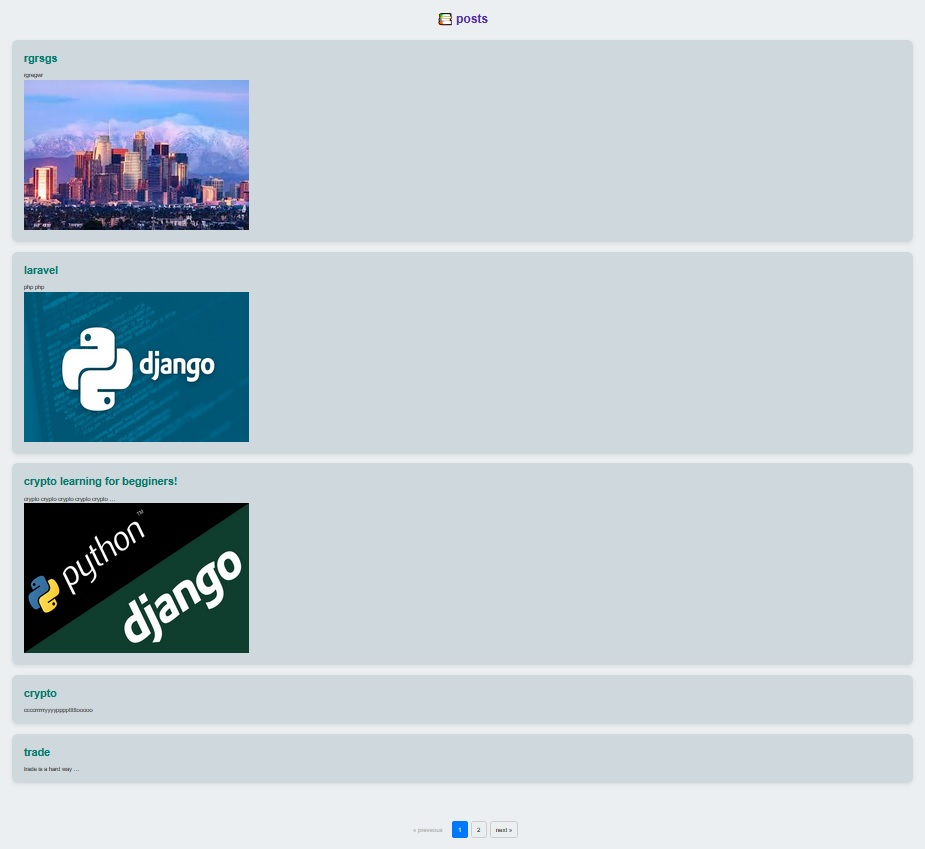
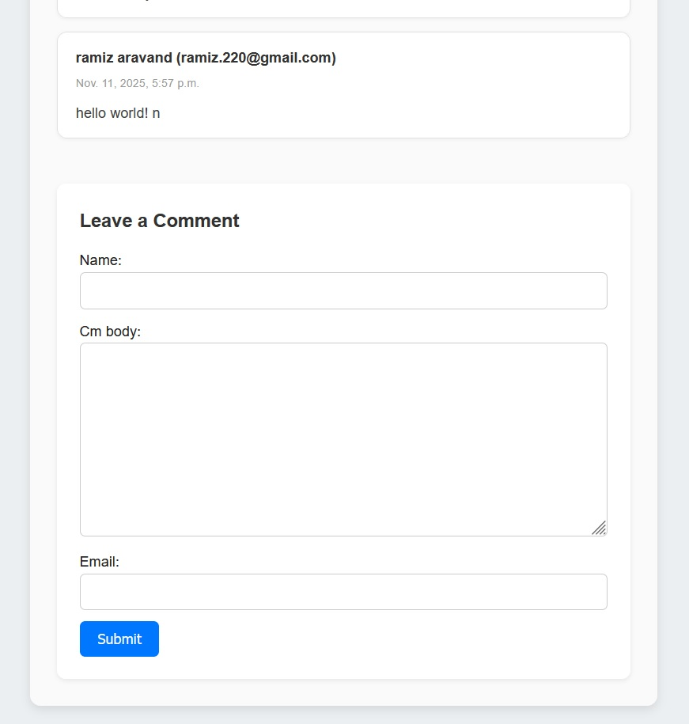
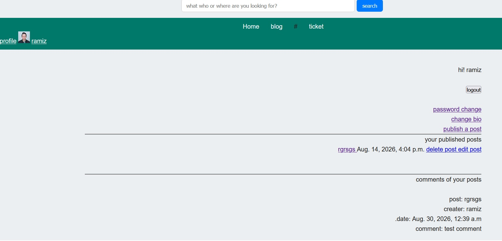
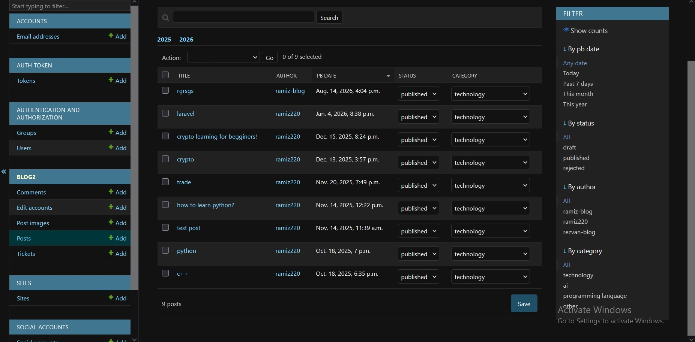
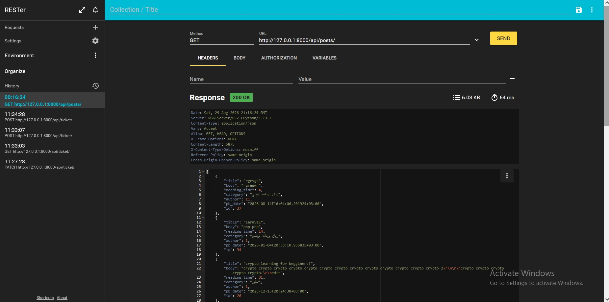
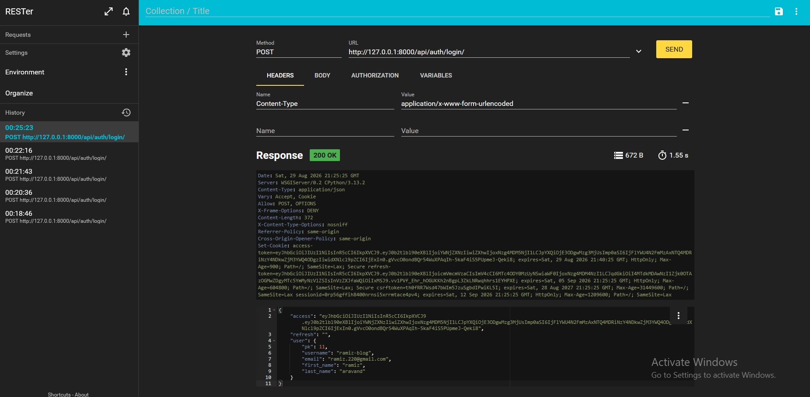

# Screenshots

<p align="center">
  
  
  
</p>
<p align="center">
  
  
  
</p>
<p align="center">
  
  
</p>


# Django Blog Project

A full-featured blog application built with **Django** and **Django REST Framework**, combining a server-rendered web application with a RESTful API.

The project includes blog post management, categories, comments, image uploads, user accounts and profiles, authentication, password management, ticket submission, PostgreSQL-powered search, customized Django Admin, and JWT-based API authentication.

---

## Features

### Blog

* Create and manage blog posts
* Categorize and filter posts
* Draft, published, and rejected post states
* Automatic slug generation
* Reading time and publication date
* Author association
* Custom manager for published posts
* Pagination
* Multiple images per post
* Image upload and deletion
* Automatic image file cleanup
* Random published post on the homepage


### Comments

* Submit comments on published posts
* Admin approval before comments are displayed
* Approved comments displayed on post detail pages
* Creation and update timestamps
* Comments ordered by creation date

### Search

The project uses **PostgreSQL trigram similarity** for approximate text search.

Search supports:

* Post titles
* Post content
* Author usernames

Results are ordered by similarity score.

### User Accounts

The project uses Django's built-in `User` model with a separate `EditAccount` model for additional profile information.

Features include:

* User registration
* Email-based authentication
* Email verification
* Login and logout
* Password change
* Password reset
* User profiles
* Profile editing
* Biography
* Profile photo
* Date of birth
* Job information

### Ticket System

Users can submit tickets containing:

* Name
* Email
* Phone number
* Subject
* Message

The submission time is automatically recorded when the ticket is created.

Tickets can be managed through Django Admin.

---

# Web Application

The project provides a server-rendered web application using Django templates.

## Homepage

| Method | URL      | Description                                                                                                           |
| ------ | -------- | --------------------------------------------------------------------------------------------------------------------- |
| `GET`  | `/blog/` | Homepage displaying a random published post, along with hot posts and post/comment counts using custom template tags. |


## Posts

| Method | URL                       | Description                                        |
| ------ | ------------------------- | -------------------------------------------------- |
| `GET`  | `/blog/posts/`            | Display paginated published posts                  |
| `GET`  | `/blog/posts/<category>`  | Display published posts filtered by category       |
| `GET`  | `/blog/posts/detail/<id>` | Display a published post and its approved comments |

The post list displays **5 posts per page**.

## Comments

| Method | URL                       | Description                           |
| ------ | ------------------------- | ------------------------------------- |
| `POST` | `/blog/post/<id>/comment` | Submit a comment for a published post |

Comments are inactive by default and must be approved through Django Admin.

## Search

| Method | URL                  | Description            |
| ------ | -------------------- | ---------------------- |
| `GET`  | `/blog/post-search/` | Search published posts |

The search covers post titles, post content, and author usernames using PostgreSQL trigram similarity.

## Tickets

| Method | URL             | Description             |
| ------ | --------------- | ----------------------- |
| `GET`  | `/blog/ticket/` | Display the ticket form |
| `POST` | `/blog/ticket/` | Submit a ticket         |

Ticket submission does not require authentication.

The submission timestamp is generated automatically by Django.

## User Registration

| Method | URL               | Description               |
| ------ | ----------------- | ------------------------- |
| `GET`  | `/blog/register/` | Display registration form |
| `POST` | `/blog/register/` | Register a new user       |

An `EditAccount` profile is automatically created after registration.

## Authentication

| Method | URL             | Description              |
| ------ | --------------- | ------------------------ |
| `GET`  | `/blog/login/`  | Display login page       |
| `POST` | `/blog/login/`  | Authenticate a user      |
| `POST` | `/blog/logout/` | Log out the current user |

The web application uses Django's built-in authentication system.

## Password Management

### Password Change

| Method | URL                           | Description                        |
| ------ | ----------------------------- | ---------------------------------- |
| `GET`  | `/blog/password-change/`      | Display password change form       |
| `POST` | `/blog/password-change/`      | Change the current user's password |
| `GET`  | `/blog/password-change/done/` | Password change confirmation       |

### Password Reset

| Method     | URL                                      | Description                |
| ---------- | ---------------------------------------- | -------------------------- |
| `GET/POST` | `/blog/password_reset/`                  | Request a password reset   |
| `GET`      | `/blog/password_reset/done/`             | Reset request confirmation |
| `GET/POST` | `/blog/password_reset/<uidb64>/<token>/` | Confirm password reset     |
| `GET`      | `/blog/password_reset/complete/`         | Password reset completion  |

## User Profile

Profile functionality requires authentication.

| Method     | URL                          | Description                              |
| ---------- | ---------------------------- | ---------------------------------------- |
| `GET`      | `/blog/profile/`             | Display the authenticated user's profile |
| `GET`      | `/blog/profile/user-bio/`    | Display profile information              |
| `GET/POST` | `/blog/profile/edit-profile` | Edit user and profile information        |

The profile page displays the user's published, draft, and rejected posts.

## Creating Posts

Creating posts requires authentication.

| Method | URL                            | Description                |
| ------ | ------------------------------ | -------------------------- |
| `GET`  | `/blog/profile/creating-post/` | Display post creation form |
| `POST` | `/blog/profile/creating-post/` | Create a new draft post    |

When a post is created, the authenticated user is assigned as its author and the post is initially saved as a draft.

## Editing Posts

Editing posts requires authentication.

| Method | URL                                  | Description               |
| ------ | ------------------------------------ | ------------------------- |
| `GET`  | `/blog/blog2/profile/edit-post/<id>` | Display post editing form |
| `POST` | `/blog/blog2/profile/edit-post/<id>` | Update a post             |

Edited posts are saved as drafts again.

## Deleting Posts

Deleting posts requires authentication.

| Method | URL                                      | Description                   |
| ------ | ---------------------------------------- | ----------------------------- |
| `GET`  | `/blog/blog2/profile/deleting-post/<id>` | Display deletion confirmation |
| `POST` | `/blog/blog2/profile/deleting-post/<id>` | Delete a post                 |

Deleting a post also removes its associated image files.

## Post Images

| Method | URL                                     | Description         |
| ------ | --------------------------------------- | ------------------- |
| `GET`  | `/blog/blog2/profile/delete-image/<id>` | Delete a post image |

The application prevents deleting the last remaining image of a post.

---

# REST API

The project provides a RESTful API using **Django REST Framework**.

The API is available under:

```text
/api/
```

## API Authentication

API authentication is implemented using **JWT** with `dj-rest-auth`, Django Allauth, and Simple JWT.

JWT access and refresh tokens are configured to use **HttpOnly cookies**.

### Authentication Endpoints

| Method  | Endpoint                               | Description                                 |
| ------- | -------------------------------------- | ------------------------------------------- |
| `POST`  | `/api/auth/login/`                     | Authenticate a user                         |
| `POST`  | `/api/auth/logout/`                    | Log out the authenticated user              |
| `POST`  | `/api/auth/password/reset/`            | Request a password reset                    |
| `POST`  | `/api/auth/password/reset/confirm/`    | Confirm a password reset                    |
| `POST`  | `/api/auth/password/change/`           | Change the current user's password          |
| `GET`   | `/api/auth/user/`                      | Retrieve authenticated user details         |
| `PUT`   | `/api/auth/user/`                      | Update authenticated user details           |
| `PATCH` | `/api/auth/user/`                      | Partially update authenticated user details |
| `POST`  | `/api/auth/registration/`              | Register a new user                         |
| `POST`  | `/api/auth/registration/verify-email/` | Verify an email address                     |
| `POST`  | `/api/auth/registration/resend-email/` | Resend verification email                   |
| `POST`  | `/api/auth/token/verify/`              | Verify a JWT                                |
| `POST`  | `/api/auth/token/refresh/`             | Refresh an access token                     |

## Blog API

### Posts

| Method | Endpoint           | Description                                 |
| ------ | ------------------ | ------------------------------------------- |
| `GET`  | `/api/posts/`      | Retrieve published posts                    |
| `GET`  | `/api/posts/<id>/` | Retrieve a published post with its comments |

The post list API returns:

* Title
* Body
* Reading time
* Category
* Author
* Publication date
* ID

The post detail API additionally includes the post's comments.

### Users

| Method   | Endpoint               | Description             |
| -------- | ---------------------- | ----------------------- |
| `GET`    | `/api/users/`          | Retrieve users          |
| `GET`    | `/api/user/edit/<id>/` | Retrieve a user         |
| `PUT`    | `/api/user/edit/<id>/` | Update a user           |
| `PATCH`  | `/api/user/edit/<id>/` | Partially update a user |
| `DELETE` | `/api/user/edit/<id>/` | Delete a user           |

User access is controlled through custom DRF permissions.

### Tickets

| Method | Endpoint       | Description         |
| ------ | -------------- | ------------------- |
| `POST` | `/api/ticket/` | Create a new ticket |

Ticket creation is available without authentication.

---

# API Permissions

The API uses custom Django REST Framework permission classes.

### PostListDetailPermission

Provides read-only access to published post endpoints.

### UserEditPermission

Controls access to individual user objects.

* Superusers have full access
* Authenticated users can access their own user object
* Staff users have read-only access
* Other users are denied access

### UserListPermission

Controls access to the user list endpoint and currently allows safe HTTP methods.

### TicketPermission

Allows ticket creation through `POST`.

---

# Django Admin

The project includes customized Django Admin interfaces for:

* Posts
* Tickets
* Comments
* Post images
* User accounts

The Post Admin provides search, filtering, ordering, date hierarchy, editable status and categories, author selection, and inline management of comments and images.

The Comment Admin allows administrators to approve or deactivate comments.

---

# Database Models

The project uses Django ORM with PostgreSQL.

### Post

Represents a blog post and includes title, body, author, slug, publication date, timestamps, status, reading time, and category.

### Comment

Represents comments associated with blog posts and includes an approval status.

### PostImage

Stores multiple images associated with blog posts.

### Ticket

Stores user-submitted support/contact tickets.

### EditAccount

Stores additional profile information through a one-to-one relationship with Django's built-in `User` model.

---

# Project Structure

```text
Django Blog Project Second/
│
├── blog2/
│   ├── admin.py
│   ├── forms.py
│   ├── models.py
│   ├── views.py
│   ├── blog2_urls.py
│   ├── migrations/
│   ├── static/
│   ├── templates/
│   └── templatetags/
│
├── proj_Api/
│   ├── permissions.py
│   ├── serializer.py
│   ├── views.py
│   ├── api_urls.py
│   └── migrations/
│
├── Django_Blog_Project_second/
│   ├── settings.py
│   ├── urls.py
│   ├── asgi.py
│   └── wsgi.py
│
├── manage.py
├── requirements.txt
├── .env
├── .gitignore
└── README.md
```

---

# Technologies

* **Python**
* **Django 5.2.7**
* **Django REST Framework 3.18.0**
* **PostgreSQL**
* **dj-rest-auth**
* **Django Allauth**
* **Simple JWT**
* **Pillow**
* **django-jalali**
* **Jdatetime**
* **django-widget-tweaks**
* **python-dotenv**

---

# Security

Sensitive configuration is loaded through environment variables rather than being hard-coded in `settings.py`.

Environment variables are used for:

* Django `SECRET_KEY`
* Database credentials
* Email credentials
* Debug configuration
* Database connection settings

Example:

```env
SECRET_KEY=your-secret-key
DEBUG=False

DB_NAME=your_database
DB_USER=your_database_user
DB_PASSWORD=your_database_password
DB_HOST=localhost
DB_PORT=5432

EMAIL_HOST_USER=your-email
EMAIL_HOST_PASSWORD=your-email-password
```

The `.env` file and local database are excluded from version control.

---

# Installation

Clone the repository:

```bash
git clone <repository-url>
cd Django-Blog-Project
```

Create a virtual environment:

```bash
python -m venv .venv
```

Activate it on Windows:

```powershell
.venv\Scripts\Activate.ps1
```

Install dependencies:

```bash
pip install -r requirements.txt
```

Configure the required environment variables in `.env`.

Run migrations:

```bash
python manage.py migrate
```

Create a superuser:

```bash
python manage.py createsuperuser
```

Start the development server:

```bash
python manage.py runserver
```

The application will be available at:

```text
http://127.0.0.1:8000/
```

---

# Main Access Points

| Service         | URL       |
| --------------- | --------- |
| Web Application | `/blog/`  |
| REST API        | `/api/`   |
| Django Admin    | `/admin/` |

---

# Project Highlights

This project demonstrates practical experience with:

* Django ORM
* PostgreSQL
* Django Forms and ModelForms
* Django authentication
* Email verification
* Password reset workflows
* File and image handling
* Custom model managers
* Pagination
* PostgreSQL trigram similarity search
* Django Admin customization
* Django REST Framework
* Generic API views
* Model serializers
* Custom DRF permissions
* JWT authentication
* HttpOnly cookies
* Environment-based configuration

---

## Project Status

The project is actively being developed and will be updated over time, with a particular focus on expanding and improving the REST API endpoints and overall API functionality.
